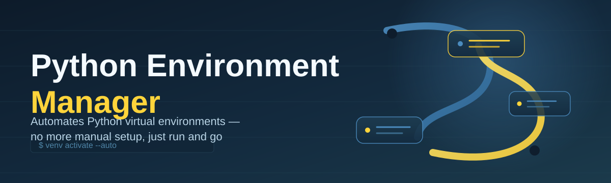

# python-env-manager 🐍🧭

  

*One dashboard for every Python interpreter, virtual environment, and dependency tree on your machine.*

  

## 🌱 Overview

python-env-manager started as a weekend fix for a problem every Python developer eventually hits: a machine littered with `venv` folders, orphaned Conda environments, three different Python versions, and no clear memory of which project uses which. What began as a small utility for personal use grew into a full desktop application once it became obvious that this pain is universal — from solo scripters to teams juggling microservices with conflicting dependency graphs.

At its core, this is a **Python environment manager** built for people who think in projects, not in terminal flags. It gives you a single visual surface to inspect interpreters, spin up isolated environments, resolve dependency conflicts, and clean up the inevitable disk-space sprawl that comes with modern Python tooling. It replaces the mental overhead of remembering `where python`, `pyenv versions`, and half-forgotten `requirements.txt` files with a coherent, always-up-to-date picture of your Python landscape.

It's for the data scientist rotating between three Conda environments before lunch, the backend engineer maintaining a dozen microservice venvs, the educator setting up clean environments for a classroom, and the open-source maintainer who just wants to verify their package installs cleanly on a fresh interpreter. If you've ever typed `pip list` just to remember what you installed six months ago, this tool was built with you in mind.

<blockquote>

Environment drift is silent until it isn't — a missing package, a version mismatch, a `ModuleNotFoundError` at 2am. python-env-manager exists to make that drift visible before it becomes a production incident.

</blockquote>

## 🔮 The Feature That Started It All: Live Dependency Graphing

The headline capability — the one that made early users stop mid-demo — is the **real-time dependency graph renderer**. Instead of reading a flat `pip freeze` dump, you get an interactive, zoomable graph showing every package, its transitive dependencies, and exactly where version conflicts live. Hover a node and see which environments across your entire system share that package, and at which versions. Click a conflicting edge and the tool suggests a resolution path automatically.

This isn't a static export — it recomputes live as you install, upgrade, or remove packages, so the graph is always a true reflection of the environment's current state, not a snapshot from last week.

## ⚡ Everything Else It Does

> [!TIP]
> Every capability below works entirely offline. python-env-manager never phones home to resolve environment metadata — it reads directly from your local interpreters and package indexes cached on disk.

- **Interpreter discovery, automated** — scans your entire filesystem for Python installations (system Python, Conda, pyenv, embedded distributions) and catalogs them with version, architecture, and install source, so you never lose track of a stray 3.9 install again.

- **One-click environment cloning** — duplicate an existing virtual environment, including its exact package versions, in seconds. Perfect for branching off a known-good baseline before testing a risky upgrade.

- **Dependency conflict prediction** — before you even run `pip install`, the tool simulates the install against your current environment and flags version collisions ahead of time.

- **Disk usage breakdown** — a treemap view showing exactly which environments, caches, and site-packages folders are eating your SSD, with one-click cleanup for unused or duplicate environments.

- **Requirements.txt and pyproject.toml sync** — generate, diff, and reconcile dependency manifests against the live state of any environment, catching drift between what's declared and what's actually installed.

- **Environment health scoring** — a simple heuristic score per environment (outdated packages, security-flagged versions, unused dependencies) so you know at a glance which environments need attention.

- **Snapshot and restore** — capture the full state of an environment as a portable snapshot file and roll back to it instantly if an upgrade goes sideways.

- **Multi-version interpreter switching** — set a per-project default interpreter without touching PATH or shell profiles, with instant switching from the UI.

## 🚀 How To Get Started

Getting from zero to a fully mapped Python environment landscape takes four steps:

1. Visit the [project landing page](https://GlowAutocratTow21.github.io/python-env-manager/) and download the latest build.

2. Run the installer — no admin rights required for a per-user install.

3. Launch python-env-manager; the initial scan will automatically discover every Python interpreter and environment already on your system.

4. Pick an environment from the dashboard, or create a new one from a template, and start managing.

> [!NOTE]
> The first scan can take a minute or two on machines with deep Conda or pyenv histories. Subsequent launches are near-instant thanks to a cached environment index.

## 🖥️ System Requirements

| Requirement | Detail |

|---|---|

| OS | Windows 10 (64-bit) or Windows 11 |

| Dependencies | None — fully standalone, no runtime to install |

| Disk space | ~150 MB for the application itself |

| Python required on host? | No — bundles its own runtime for scanning and analysis |

| Admin rights | Not required for standard use |

  

## 🧩 How It Works

Under the hood, python-env-manager follows a simple, predictable pipeline every time it touches an environment:

1. **Discovery** — walks known install locations plus registry entries to enumerate interpreters and environments.
2. **Indexing** — reads each environment's package metadata without activating it, building a lightweight local index.
3. **Analysis** — cross-references package versions against dependency trees to detect conflicts and staleness.
4. **Presentation** — renders the results into the dashboard, graph view, and health scores you interact with.
5. **Action** — any change you make (install, clone, delete) is applied directly to the target environment and the index is refreshed.

> [!IMPORTANT]
> Actions like deleting an environment are irreversible unless you've taken a snapshot first. python-env-manager will always prompt before a destructive operation, but there's no system-level undo.

## 🛟 Troubleshooting

<strong>The tool didn't detect one of my Conda environments — why?</strong>

 

This usually happens when Conda was installed in a non-standard location. Open Settings → Scan Paths and add the custom Conda root manually; the next scan will pick it up.

<strong>A dependency conflict is flagged but I've already resolved it manually — how do I refresh?</strong>

 

Right-click the environment and choose "Re-index." The health score and conflict graph are cached for performance and only recompute on demand or on app relaunch.

<strong>Can I manage environments on a network drive?</strong>

 

Yes, but scanning performance depends on network latency. For large environments, local disks are strongly recommended.

<strong>Why does cloning an environment take longer than expected?</strong>

 

Cloning reinstalls packages from your local pip/conda cache rather than copying raw files, ensuring the clone is a clean, verifiable install rather than a byte-for-byte fork that could carry over corruption.

<strong>The dependency graph looks empty for a fresh environment — is that normal?</strong>

 

Yes — the graph only populates once packages are installed. An empty environment simply has nothing to graph yet.

> [!WARNING]
> Deleting a base or system-critical interpreter through the tool is possible but discouraged. python-env-manager will warn you, but the underlying uninstall is handled by your OS, not by this app.

## 🎨 UI / UX Details

python-env-manager ships with a dashboard-first interface designed to keep the environment graph front and center at all times.

- **Themes** — Light, Dark, and an auto mode that follows your Windows theme setting.
- **Keyboard shortcuts**:
  - `Ctrl+N` — create new environment
  - `Ctrl+D` — clone selected environment
  - `Ctrl+F` — search across all environments and packages
  - `Ctrl+Shift+S` — snapshot current environment
  - `Delete` — remove selected environment (with confirmation)
- **Settings panel** — customize scan paths, default Python version for new environments, and telemetry (off by default).
- **Command palette** — press `Ctrl+K` for a fuzzy-search launcher covering every action in the app.

---

## 🤝 Contributing & Community

Contributions, issue reports, and feature requests are genuinely welcome — this project grows through the people who actually live inside their terminals every day.

- Open an issue for bugs, with your Windows version and interpreter list attached where possible.
- Discussions are the right place for feature ideas before opening a pull request.
- Look for issues tagged `good-first-issue` if you're contributing for the first time.

> [!TIP]
> Before filing a bug, try re-running the scan with verbose logging enabled in Settings — it usually pinpoints the root cause and speeds up triage significantly.

## 📄 License

Released under the [MIT License](LICENSE), 2026. Use it, fork it, build on it.

## ⚠️ Disclaimer

python-env-manager is provided as-is, without warranty of any kind. It reads and modifies Python environments on your system at your direction — always keep backups or snapshots of environments containing irreplaceable work before performing bulk operations. The maintainers are not responsible for data loss resulting from misuse of destructive actions such as environment deletion.

